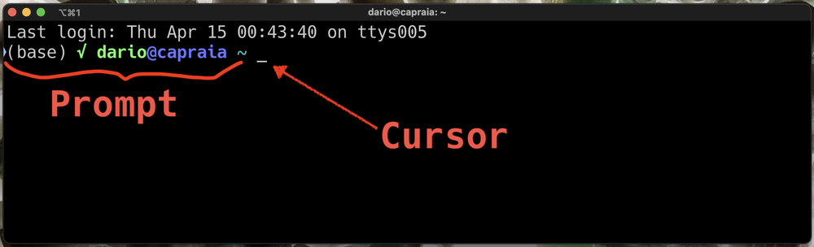
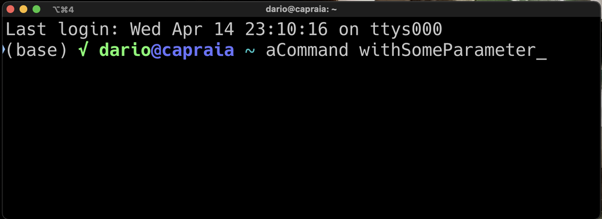

# La shell: parlare al sistema operativo

> **Materiale pre-lezione.** Da studiare **prima** di venire in aula, dopo aver
> guardato i video `L02_p3_Shell` e `L02_p4_PythonEShell`.
>
> **Serve un terminale funzionante.** Se non hai ancora accesso alla macchina
> virtuale del corso, segui `guida_VM.md`: l'iscrizione può richiedere fino a 12
> ore, quindi non rimandarla all'ultimo giorno.
>
> **Cosa non trovi qui.** Come è fatto un calcolatore, come funziona un sistema
> operativo e com'è organizzato un file system stanno nei lucidi e nei video
> `L02_p1_Intro` e `L02_p2_FileSystem`. Questo documento è la parte che non si
> può imparare guardando: qui si digita.
>
> Tempo di lettura con le mani sulla tastiera: **45–60 minuti**.

Tutti gli esempi sono per un sistema **Unix** — Linux o macOS — che è quello
della macchina virtuale su cui lavoreremo tutto l'anno. Su Windows i comandi
hanno nomi diversi (`dir` invece di `ls`, `copy` invece di `cp`): la tabella di
confronto è nei lucidi, ma il corso si fa sulla VM.

---

## Perché una riga di comando

Le interfacce grafiche esistono da quarant'anni e la shell è ancora lì. Non è
nostalgia: fa cose che il mouse non sa fare.

- **Ripetibilità.** Un comando si riscrive identico domani, si incolla in uno
  script, si manda a un collega. Una sequenza di click no.
- **Tracciabilità.** Alla fine di un'analisi la lista dei comandi dati *è* il
  verbale di cosa hai fatto ai dati. È il primo passo verso un lavoro che altri
  possono verificare.
- **Scala.** Cancellare 100 file `.txt` sparsi fra altri 900: con il mouse sono
  100 trascinamenti nel cestino, con la shell è un comando.
- **Macchine remote.** I dataset grossi non stanno sul portatile ma su un
  server, e a un server ci si parla via shell. Non c'è un desktop da cui
  cliccare.

Per uno statistico il punto è il secondo: un'analisi che non si sa rifare non è
un'analisi, è un aneddoto.

---

## Il prompt: cosa stai guardando

Apri il terminale. Quello che vedi non è una schermata vuota che aspetta parole
magiche: ogni pezzo dice qualcosa.



Da sinistra a destra:

- **utente e macchina** — chi sei e su quale computer stai lavorando. Serve più
  di quanto sembri: quando sei collegato a una macchina remota è l'unica cosa
  che ti dice che non sei più sul tuo portatile;
- **la directory corrente** — *dove sei* nel file system. È il concetto più
  importante di tutta la lezione, e ci torniamo sotto;
- il **simbolo del prompt** (`$`) — fine delle informazioni, inizio di quello
  che scrivi tu;
- il **cursore** — dove finiranno i caratteri che digiti.

La shell funziona a turni: tu scrivi un comando, premi `invio`, la shell lo
esegue e stampa il risultato, poi ti ripresenta il prompt. Se il prompt non
torna, il comando è ancora in esecuzione.

Nel seguito le righe che iniziano con `$` sono quello che scrivi tu — **il `$`
non va digitato** — e le righe successive sono la risposta della shell.

---

## L'anatomia di un comando

Un comando ha sempre la stessa forma:

```
comando [opzioni] [argomenti]
```

dove tutto ciò che è fra parentesi quadre è facoltativo — e le parentesi quadre
non si scrivono.

```bash
$ ls              # solo il comando
$ ls -l           # comando + un'opzione
$ ls -l data      # comando + opzione + argomento
```

Le **opzioni** cambiano il comportamento del comando, gli **argomenti** dicono
su cosa lavorare. Le opzioni hanno due forme, breve e lunga, e la forma breve si
può accorpare:

```bash
$ ls -l -a        # due opzioni brevi
$ ls -la          # le stesse due, accorpate
$ ls --all        # forma lunga di -a
```



### `man` — il manuale di ogni comando

Nessuno ricorda le opzioni a memoria. Ogni comando porta con sé il proprio
manuale:

```bash
$ man ls
```

Si scorre con le frecce o con la barra spaziatrice, si cerca con `/parola`, si
esce con `q`. Se in questa pagina non trovi l'opzione che ti serve, `man` è il
posto dove cercarla.

### Le tre scorciatoie che cambiano la vita

Sono tre, si imparano in due minuti e fanno la differenza fra trovare la shell
scomoda e trovarla comoda.

| Tasto | Cosa fa |
|:---|:---|
| `tab` | completa il nome che hai iniziato a scrivere: comando, file o directory |
| frecce **su** e **giù** | scorrono i comandi già dati (la *history*) |
| `ctrl-c` | interrompe il comando in esecuzione |

Il `tab` non è solo comodità: **è il modo di non sbagliare i nomi**. Se premi
`tab` e non completa, il nome che stai scrivendo non esiste — e lo sai prima di
premere invio, non dopo aver letto un messaggio d'errore.

---

## Dove sono e come mi muovo

Tre comandi, e sono la risposta a tre domande.

### `pwd` — dove sono?

*Print working directory*: stampa il percorso della directory corrente.

```bash
$ pwd
/home/dario.pescini
```

### `ls` — cosa c'è qui?

*List*: elenca il contenuto della directory.

```bash
$ ls
Desktop  Documenti  GoogleDrive  data

$ ls -l                     # una riga per file, con i dettagli
totale 16
drwxr-xr-x 2 dario.pescini studenti 4096 set 19 10:12 Desktop
-rw-r--r-- 1 dario.pescini studenti  284 set 19 10:15 note.txt

$ ls -la                    # include i file nascosti (quelli che iniziano con .)
$ ls -lh                    # dimensioni leggibili: 4.0K invece di 4096
$ ls data                   # il contenuto di un'altra directory, senza andarci
$ ls -R                     # anche il contenuto delle sottodirectory, in cascata
```

La forma `-l` mostra, da sinistra: i permessi, il proprietario, il gruppo, la
dimensione in byte, la data di ultima modifica, il nome. Sono i **metadati** del
file di cui parlano i lucidi: il file system non conserva solo il contenuto.

### `cd` — portami lì

*Change directory*: sposta la directory corrente.

```bash
$ cd data           # entra in data
$ cd ..             # sale di un livello
$ cd                # torna nella tua home, da qualunque punto
$ cd -              # torna dove eri prima
```

`cd` senza argomenti è la via di fuga universale: se ti sei perso, ti riporta a
casa.

---

## I percorsi

Questa sezione è la più importante del documento. Gli errori più frequenti di
tutto il corso — compresi quelli che vedrai fra due mesi quando Python non
troverà un file `.csv` — sono errori di percorso.

Un **percorso** è l'indirizzo di un file o di una directory nell'albero del file
system. Ci sono due modi di darlo.

Un percorso **assoluto** parte dalla radice `/` e non dipende da dove ti trovi:

```bash
/home/dario.pescini/data/meteo.csv
```

Un percorso **relativo** parte dalla directory corrente:

```bash
data/meteo.csv      # il file meteo.csv nella directory data, dentro quella corrente
```

Lo stesso file, due indirizzi: come «via Bicocca 12, Milano» e «la seconda porta
a destra». Il secondo funziona solo se chi ascolta sa dove sei.

### I simboli dei percorsi

| Simbolo | Significato |
|:---|:---|
| `/` | la radice dell'albero, e il separatore fra le directory |
| `~` | la tua home directory |
| `.` | la directory corrente |
| `..` | la directory che la contiene, un livello sopra |
| `-` | (solo con `cd`) la directory in cui eri prima |
| `*` | *qualunque sequenza di caratteri* — vedi sotto |

Supponiamo questo albero:

```
/home/dario.pescini
├── data
│   ├── meteo.csv
│   └── incidenti.csv
└── script
    └── analisi.py
```

Se la directory corrente è `script`, tutti questi percorsi indicano lo stesso
file:

```bash
/home/dario.pescini/data/meteo.csv      # assoluto
~/data/meteo.csv                        # dalla home
../data/meteo.csv                       # su di uno, poi dentro data
```

### `*` e il *globbing*

L'asterisco sta per «qualunque sequenza di caratteri», e la shell lo espande nei
nomi che esistono **prima** di passare il comando:

```bash
$ ls *.csv                  # tutti i file che finiscono con .csv
$ ls meteo*                 # tutti quelli che iniziano con meteo
$ ls data/*.csv             # tutti i .csv dentro data
```

È questo che rende un comando solo equivalente a cento trascinamenti nel
cestino. Ed è anche il motivo per cui `rm *` è pericoloso.

> **La directory corrente conta anche in Python.** Quando in una lezione
> scriveremo `pd.read_csv("data/meteo.csv")`, quel percorso è relativo alla
> directory da cui hai lanciato Python, non a quella in cui sta lo script. Il
> `FileNotFoundError` più comune del corso è un `pwd` sbagliato, non un nome di
> file sbagliato.

---

## Lavorare con i file

Da qui in poi ogni comando è presentato con un esempio minimo. Gli esercizi per
farci le mani sono in `L02_esercizi.md`: qui si guarda, lì si fa.

### `mkdir` — crea una directory

```bash
$ mkdir E01                 # crea la directory E01
$ mkdir -p E01/d01/d02      # crea anche le directory intermedie che mancano
```

Senza `-p`, se `E01` non esiste, `mkdir E01/d01` fallisce.

### `touch` — crea un file vuoto

```bash
$ touch note.txt
```

Serve soprattutto per avere un file su cui provare i comandi che seguono. (Su un
file che esiste già, `touch` aggiorna la data di ultima modifica.)

### `cp` — copia

```bash
$ cp note.txt copia.txt         # copia un file
$ cp note.txt d01/              # copia dentro una directory, stesso nome
$ cp -r d01 d01_backup          # copia una directory con tutto il contenuto
```

Le directory richiedono `-r` (*recursive*): senza, `cp` si rifiuta.

### `mv` — sposta, e rinomina

```bash
$ mv note.txt d01/              # sposta il file in d01
$ mv note.txt appunti.txt       # lo rinomina
```

Sono la stessa operazione: cambiare il percorso di un file. Spostarlo cambia la
directory, rinominarlo cambia l'ultimo pezzo del nome.

### `rm`, `rmdir` — cancella

```bash
$ rm note.txt                   # cancella un file
$ rmdir d01                     # cancella una directory, ma solo se è vuota
$ rm -r d01                     # cancella una directory e tutto il contenuto
```

> **`rm` non chiede conferma e non esiste un cestino.** Quello che cancelli è
> cancellato. `rm -i` chiede conferma file per file, e all'inizio conviene
> usarlo.

### `cat` — mostra il contenuto

```bash
$ cat note.txt
prima riga
seconda riga
```

Stampa tutto il file di fila. Va bene per file corti; per un `.csv` da 50.000
righe ti riempie lo schermo e non ti fa leggere niente.

### `less` — leggi un file con calma

```bash
$ less incidenti.csv
```

Mostra il file una schermata per volta. Si naviga con le frecce, si cerca con
`/parola`, si esce con `q` — le stesse scorciatoie di `man`, che è lo stesso
programma.

### `head` e `tail` — le prime righe, le ultime

```bash
$ head incidenti.csv            # le prime 10 righe
$ head -n 3 incidenti.csv       # le prime 3
$ tail -n 3 incidenti.csv       # le ultime 3
```

`head -n 1` su un `.csv` mostra l'intestazione: è il modo più rapido di sapere
quali colonne ha un file prima di aprirlo con pandas.

### `wc` — conta righe, parole, caratteri

```bash
$ wc -l incidenti.csv           # numero di righe
   12457 incidenti.csv
```

Su un `.csv` con intestazione, le osservazioni sono `wc -l` meno uno.

### `|` — la pipe, comandi in catena

La pipe manda l'**output** di un comando nell'**input** del successivo:

```bash
$ head -n 6 incidenti.csv | tail -n 2     # la quinta e la sesta riga
```

Il primo comando prende le prime 6 righe, il secondo tiene le ultime 2 di
*quelle*. Nessun file intermedio, nessun click: è l'idea su cui è costruita
tutta la shell, tanti programmi piccoli che si combinano.

### `echo` e `seq` — produrre testo

`echo` stampa quello che gli dai, `seq` una sequenza di numeri. Da soli servono a
poco: diventano utili appena li si combina con la redirezione, qui sotto.

```bash
$ echo "Benvenuti"
Benvenuti

$ seq 1 5
1
2
3
4
5
```

### `>` e `>>` — scrivere il risultato in un file

```bash
$ wc -l incidenti.csv > conteggio.txt     # crea il file, o lo SOVRASCRIVE
$ wc -l meteo.csv >> conteggio.txt        # aggiunge in fondo
$ echo "Benvenuti" > saluto.txt           # un file con una riga dentro
$ seq 1 20 > numeri.txt                   # un file con venti righe
```

`>` sovrascrive senza avvisare. Se volevi aggiungere e hai scritto `>`, il
contenuto precedente non c'è più.

### `grep` — trova una stringa dentro i file

```bash
$ grep "Milano" incidenti.csv             # le righe che contengono Milano
$ grep -c "Milano" incidenti.csv          # quante sono
$ grep -i "milano" incidenti.csv          # ignora maiuscole e minuscole
$ grep -r "Milano" data/                  # cerca in tutti i file sotto data/
```

### `find` — trova i file dal nome

```bash
$ find . -name "*.csv"                    # tutti i .csv da qui in giù
$ find data -name "meteo*"                # quelli che iniziano con meteo
```

`grep` cerca **dentro** i file, `find` cerca **i** file. È una distinzione che
all'inizio sfugge e poi non si dimentica più.

### `chmod` — cambia i permessi

I permessi sono le prime lettere della riga di `ls -l`: chi può leggere,
scrivere, eseguire.

```bash
$ chmod +x analisi.py           # rende il file eseguibile
$ chmod 644 note.txt            # lettura e scrittura al proprietario, lettura agli altri
```

Ti serve quando un file che dovrebbe essere eseguibile non parte. E quando parte,
va lanciato con `./` davanti:

```bash
$ ./saluta.sh
```

Il `./` dice «il file in *questa* directory»: senza, la shell cerca un comando di
sistema con quel nome e non lo trova.

### `zip` e `unzip` — comprimi e decomprimi

```bash
$ zip -r E01.zip E01            # comprime la directory E01
$ unzip E01.zip                 # la decomprime qui
$ unzip -l E01.zip              # elenca il contenuto senza decomprimere
$ unzip E01.zip -d verifica     # decomprime dentro la directory verifica
```

I dataset arrivano quasi sempre compressi, e `unzip -l` dice cosa c'è dentro
prima di sparpagliare cento file nella directory sbagliata.

---

## Lanciare Python dalla shell

È il punto in cui questa lezione si collega a tutto il resto del corso, ed è il
contenuto del video `L02_p4_PythonEShell`.

```bash
$ python primo.py               # esegue lo script nella directory corrente
$ python script/primo.py        # percorso relativo
$ python                        # apre l'interprete interattivo
```

Dall'interprete interattivo si esce con `exit()` o con `ctrl-d`.

Prova adesso, che ti serve per la prossima lezione: crea un file `primo.py` con
una sola riga,

```python
print("Hello World")
```

e lancialo con `python primo.py`. Se la risposta è
`python: can't open file 'primo.py'`, non è colpa di Python: sei in un'altra
directory. `pwd` e `ls` dicono dove sei e cosa c'è.

---

## Le trappole, in un elenco

Sono cinque, e sono le stesse ogni anno.

1. **Gli spazi nei nomi.** `cd Nuova Cartella` cerca la directory `Nuova` e
   passa `Cartella` come secondo argomento. Servono gli apici — `cd "Nuova
   Cartella"` — o il `tab`, che li mette da sé. Meglio ancora: non usare spazi
   nei nomi dei tuoi file.
2. **Maiuscole e minuscole sono diverse.** `Dati.csv` e `dati.csv` sono due file
   distinti su Linux. Su Windows no, e questo è il motivo per cui un codice che
   funzionava sul portatile non funziona sulla VM.
3. **`rm` è definitivo.** Nessun cestino, nessuna conferma.
4. **`>` sovrascrive.** Per aggiungere serve `>>`.
5. **I percorsi relativi dipendono da dove sei.** Lo stesso comando, dato da due
   directory diverse, fa due cose diverse — o fallisce. In caso di dubbio:
   `pwd`.

---

## Cosa fare ora

| | |
|---|---|
| esercizi sui comandi, con soluzione | `L02_esercizi.md` |
| la tabella di tutti i comandi della lezione | `L02_riepilogo.md` |
| accesso alla macchina virtuale | `guida_VM.md` |
| prendere e aggiornare il materiale del corso | `guida_GitHub.md` |
| strumenti moderni (`rg`, `fd`, `bat`, …) e come installarli | `focus_ShellModerna.md` |
| usare git sulle tue analisi (facoltativo) | `focus_Git.md` |

In aula partiamo dando per fatto che il terminale si apre, che `pwd`, `ls` e `cd`
sono chiari e che `python primo.py` ha stampato `Hello World`.
