# La macchina virtuale del corso: iscrizione e accesso

> **Da fare subito, non il giorno dell'esercitazione.** L'iscrizione al
> laboratorio può richiedere **fino a 12 ore** per diventare attiva: se ti
> iscrivi il martedì, il venerdì la macchina è pronta.
>
> **Non è materia d'esame.** È la procedura per avere davanti il computer su cui
> lavoreremo tutto l'anno. Si fa una volta e non si ripensa più.
>
> **Link e nome della macchina cambiano ogni anno.** Se quelli qui sotto non
> funzionano, chiedi: non stai sbagliando tu.

Il corso si svolge su una macchina virtuale (VM) fornita dall'Ateneo attraverso
il servizio **LIBaaS**. È un computer Linux che gira su un server dell'Università
e che tu vedi dentro una finestra: ha Python già installato, gli stessi
programmi per tutti, e non dipende da com'è configurato il tuo portatile.

Puoi lavorare anche sul tuo computer, ma le istruzioni, gli esempi e l'aiuto in
aula sono per la VM.

---

## 1. Iscriversi al laboratorio

1. Apri il link di iscrizione al laboratorio del corso:

   <https://libaas.unimib.it/PubLab/register/8585de745d02f9338511>

2. Spunta la presa visione e conferma.

Da questo momento possono servire **fino a 12 ore** perché l'accesso diventi
attivo. Non c'è modo di accelerare, quindi fallo appena te lo dico a lezione.

---

## 2. Accedere alla macchina

1. Vai su <https://horizon.libaas.unimib.it/> e scegli come collegarti:

   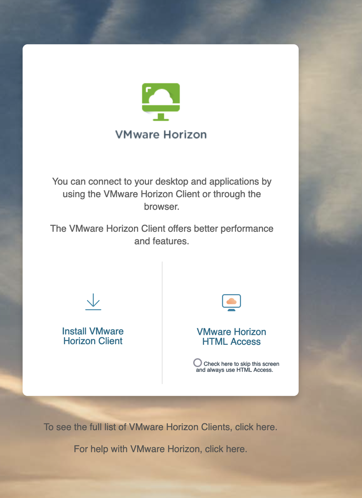{width=75%}

   - **`Horizon Client`** — usa il client installato sul tuo computer. È il
     metodo da preferire: più veloce, e gestisce meglio tastiera e schermo.
   - **`HTML Access`** — usa il browser, senza installare niente. Comodo per la
     prima volta o da un computer che non è tuo.

2. Autenticati con le credenziali **CAS** d'Ateneo, cioè il tuo account
   `nomeUtente@campus.unimib.it`:

   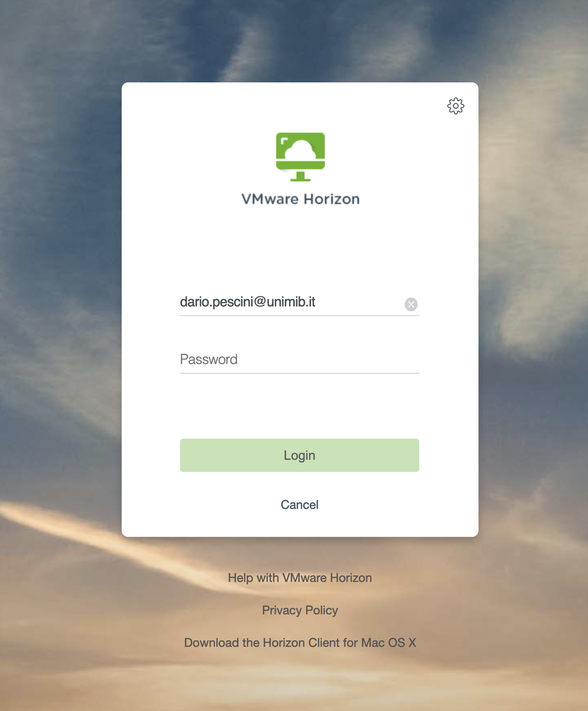{width=75%}

3. Scegli la macchina del corso: l'icona porta davanti l'**ID del laboratorio**,
   che quest'anno è **3573**, e il nome che segue è troncato — cerca
   «**3573** Laboratorio virtuale del corso…». Clicca sulla sua icona:

   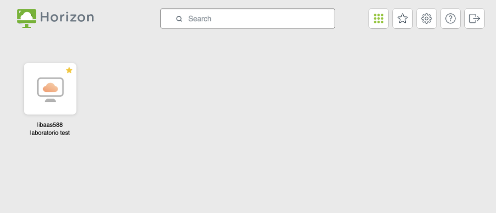{width=75%}

4. Dopo qualche secondo hai davanti il desktop della VM:

   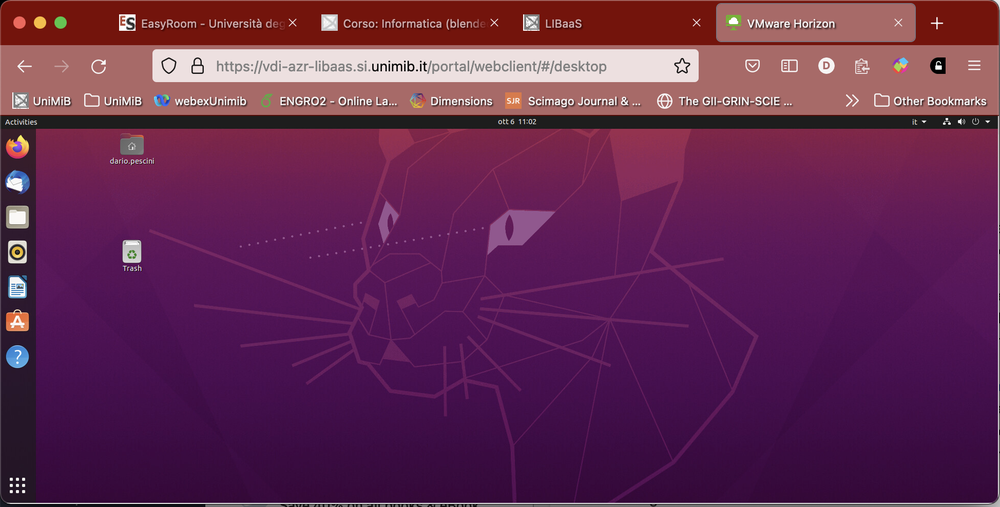{width=75%}

> **Disconnettiti sempre quando hai finito.** Le macchine sono un numero finito
> e condiviso: una sessione lasciata aperta occupa un posto.

Le guide ufficiali dell'Ateneo, più dettagliate sulla parte di connessione:

- [LIBaaS Horizon — accesso via HTML5](https://sites.google.com/unimib.it/libaas-horizon/guida-allaccesso-html5)
- [LIBaaS Horizon — accesso via client](https://sites.google.com/unimib.it/libaas-horizon/guida-allaccesso-client)

---

## 3. Portare i tuoi file dentro e fuori dalla VM

La VM non è il tuo computer: quello che salvi lì non è automaticamente sul tuo
portatile. Il modo più semplice per avere gli stessi file da entrambe le parti è
collegare il tuo Google Drive d'Ateneo.

Dalle **Impostazioni** del sistema:

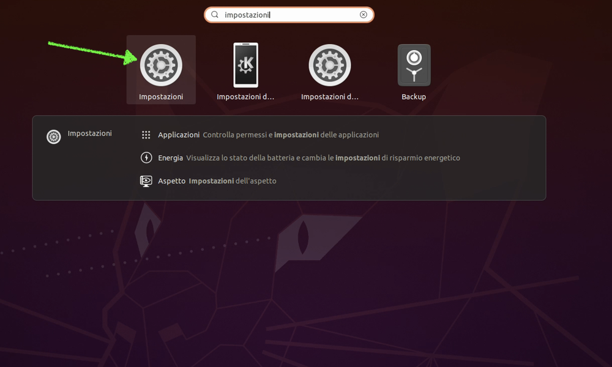{width=55%}

Scegli **Account online** e poi Google:

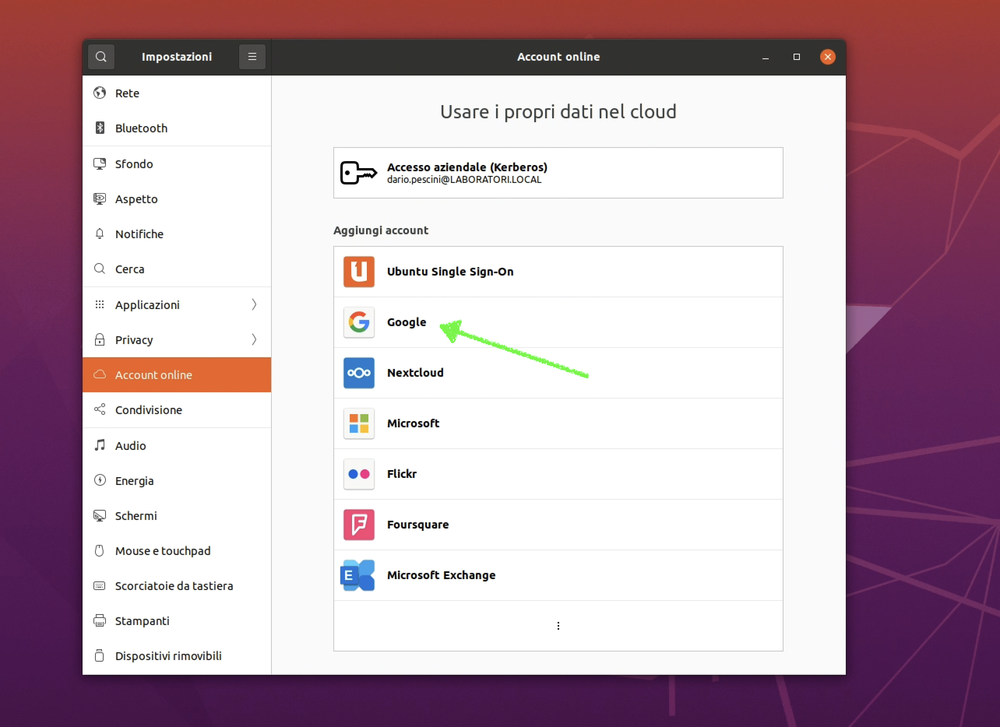{width=55%}

Inserisci il tuo utente `@campus.unimib.it`:

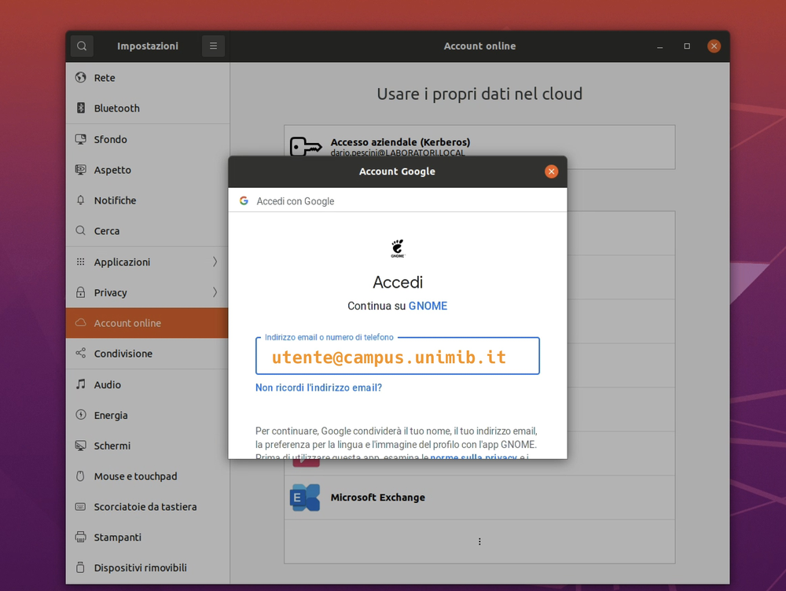{width=55%}

Autenticati con le credenziali d'Ateneo:

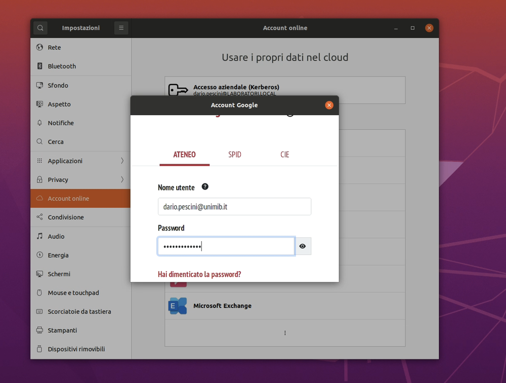{width=55%}

Acconsenti all'accesso:

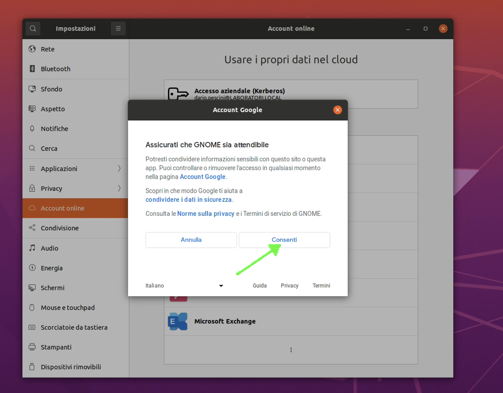{width=55%}

Scegli cosa sincronizzare — ai fini del corso basta *File*:

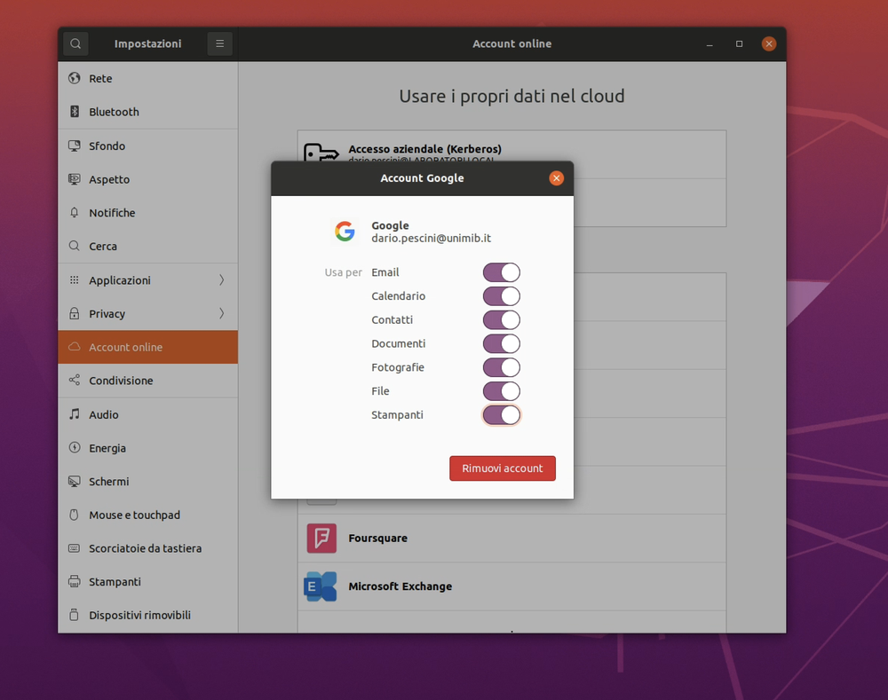{width=55%}

Da qui in avanti il tuo Drive compare fra le risorse del gestore di file:

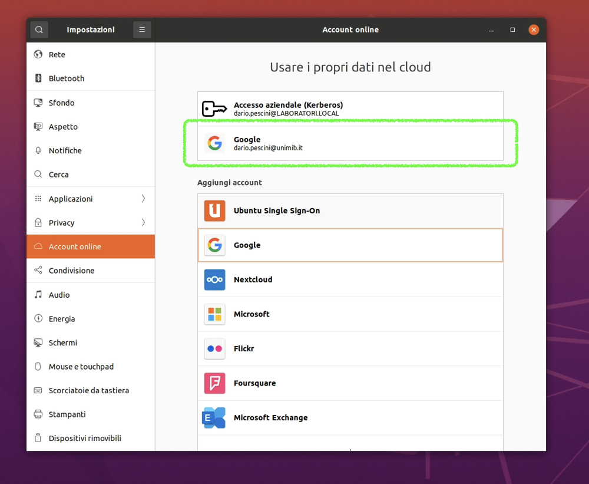{width=55%}

> **Tieni i file del corso nel Drive, non solo sulla VM.** Se la macchina viene
> reinizializzata, quello che stava soltanto lì non c'è più.

---

## 4. Aprire il terminale

È il programma con cui lavoreremo dalla seconda lezione in poi.

Clicca sull'icona in basso a sinistra per aprire la ricerca delle applicazioni:

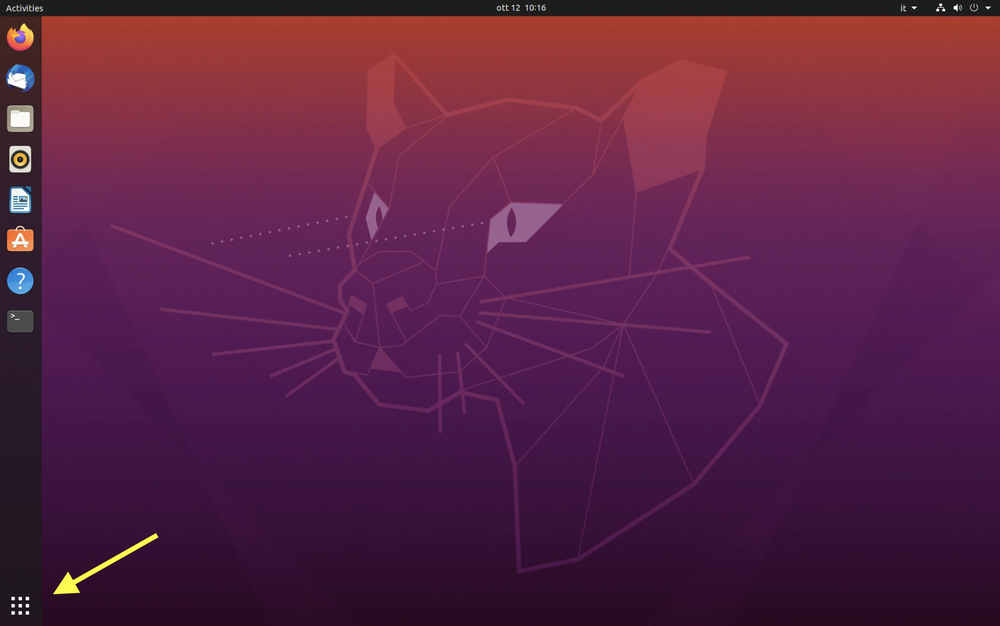{width=70%}

Scrivi «terminale» nella barra di ricerca:

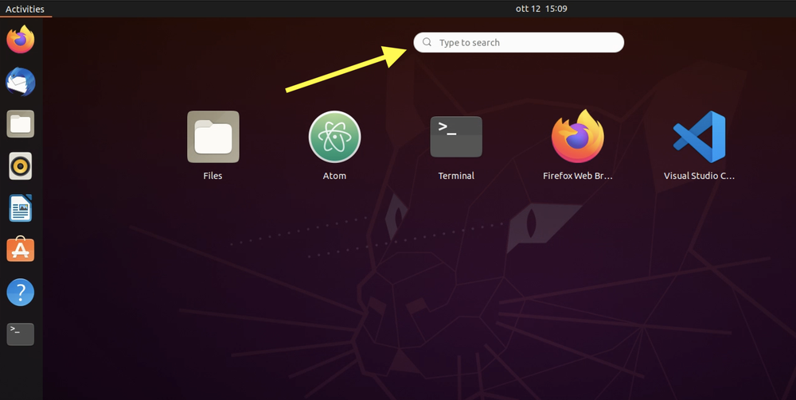{width=70%}

E hai il terminale davanti:

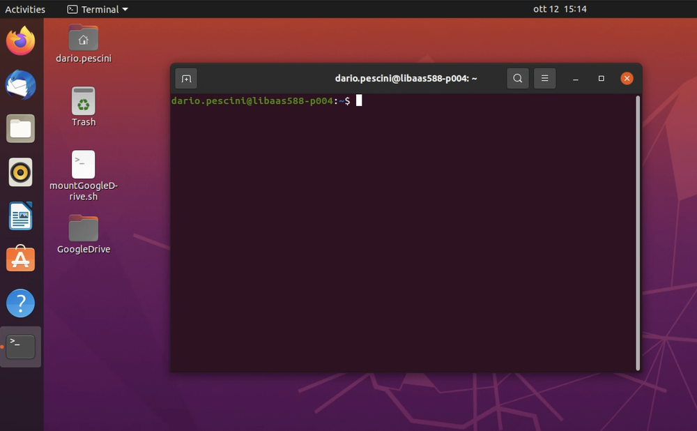{width=70%}

Quello che vedi in quella finestra — il prompt, il cursore, come si scrive un
comando — è spiegato in `L02_shell.md`. Tienilo aperto: da lì si comincia.

Il passo successivo, appena il terminale funziona, è prendere il materiale del
corso: `guida_GitHub.md`, due comandi.

---

## Se qualcosa non funziona

| Sintomo | Cosa controllare |
|:---|:---|
| il link di iscrizione dà errore | è cambiato con l'anno accademico: chiedilo a lezione o per mail |
| l'accesso dice che non sei autorizzato | sono passate meno di 12 ore dall'iscrizione, oppure l'iscrizione non è andata a buon fine |
| la macchina del corso non è nell'elenco | l'icona comincia con l'**ID del laboratorio**, che cambia ogni anno: **3573** per il 2026/27. Se ne vedi una sola, è quella |
| le credenziali non vengono accettate | serve l'account d'Ateneo `nomeUtente@campus.unimib.it`, non un indirizzo personale |
| il Drive non compare fra le risorse | rifai il punto 3: la connessione dell'account non è stata completata |

Quello che cambia ogni anno è poco e sempre lo stesso: **il link di iscrizione,
l'indirizzo di accesso e il nome della macchina**. Tutto il resto della
procedura è identico da diversi anni.
