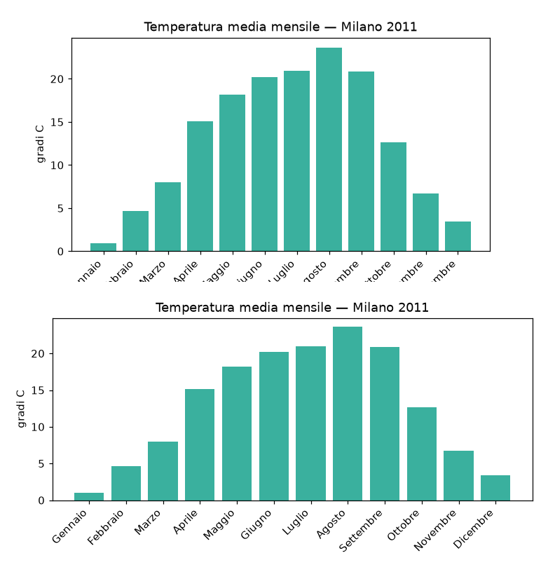

# L11_a — Rappresentare i dati con matplotlib

> **Materiale pre-lezione.** Da leggere prima di venire in aula. Questa lezione non
> ha videolezione: il materiale scritto è l'unico che precede l'incontro.
>
> **File parziale.** Contiene per ora la sola sezione *Far stare tutto dentro la
> figura*, scritta per colmare un buco documentato in
> `riepilogo_funzioni_python.md` §13: `tight_layout()` compare in **3 temi d'esame**
> e non era insegnata da nessuna parte. Il resto della lezione va ancora riportato
> qui dal notebook del 2023.

```python
import pandas as pd
import matplotlib.pyplot as plt

meteo = pd.read_csv("data/MeteoMilano2011.csv")
```

---

## Far stare tutto dentro la figura

Un grafico va etichettato: titolo, nomi degli assi, e — se le categorie hanno un
nome — le etichette sotto le barre. Le etichette lunghe però si sovrappongono, e
per leggerle si ruotano:

```python
meteo["mese"] = meteo["CET"].str.split("-").str[1].astype(int)
medieMensili = meteo.groupby("mese")["Temperatura mediaC"].mean()

nomiMesi = ["Gennaio", "Febbraio", "Marzo", "Aprile", "Maggio", "Giugno",
            "Luglio", "Agosto", "Settembre", "Ottobre", "Novembre", "Dicembre"]

fig = plt.figure(figsize=(7, 3.6))
ax = fig.add_subplot(1, 1, 1)
ax.bar(nomiMesi, medieMensili.values)
ax.set_title("Temperatura media mensile — Milano 2011")
ax.set_ylabel("gradi C")
plt.xticks(rotation=45, ha="right")
plt.savefig("meteoMensile.pdf")
```

Il grafico esce **con i nomi dei mesi tagliati**: ruotandole, le etichette escono
dal bordo inferiore della figura, e matplotlib non allarga i margini da solo.



Sopra, i mesi si leggono `nnaio`, `braio`, `mbre`. Sotto, si leggono per intero.
L'unica differenza è una riga.

### `tight_layout()`

```python
plt.tight_layout()
plt.savefig("meteoMensile.pdf")
```

`tight_layout()` misura lo spazio che titoli, etichette e tacche occupano davvero,
e ricalcola i margini perché ci stiano tutti. Va chiamata **dopo** aver disegnato e
etichettato, e **prima** di `savefig()`: agisce su com'è composta la figura in quel
momento, quindi se si chiama troppo presto non vede le etichette che verranno
aggiunte dopo.

```python
fig = plt.figure(figsize=(7, 3.6))
ax = fig.add_subplot(1, 1, 1)
ax.bar(nomiMesi, medieMensili.values)      # 1. disegna
ax.set_title("Temperatura media mensile — Milano 2011")
ax.set_ylabel("gradi C")                    # 2. etichetta
plt.xticks(rotation=45, ha="right")
plt.tight_layout()                          # 3. sistema i margini
plt.savefig("meteoMensile.pdf")             # 4. salva
```

**Quando serve.** Ogni volta che qualcosa rischia di uscire dal bordo:

- etichette ruotate, come qui
- nomi di categoria lunghi sull'asse x
- più grafici nella stessa figura con `add_subplot`, che altrimenti si accavallano
- titoli degli assi su figure piccole

Non fa danno chiamarla quando non serve. In un tema d'esame che chiede un grafico
con etichette leggibili, conviene metterla sempre.

> **Il controllo finale su un grafico d'esame.** Apri il PDF che hai salvato e
> guardalo. Un grafico giusto nei dati ma con le etichette tagliate resta un
> grafico sbagliato — e ci si accorge del taglio solo aprendo il file, non
> guardando il codice.

---

## Da completare

Il resto di `L11_a` — i tipi di grafico, colori e stili, assi e legende, figure con
più riquadri — va riportato qui dal notebook `Lezione12Matplotlib` in
`LezioniLucidi/IntroDataVisualization/`.
